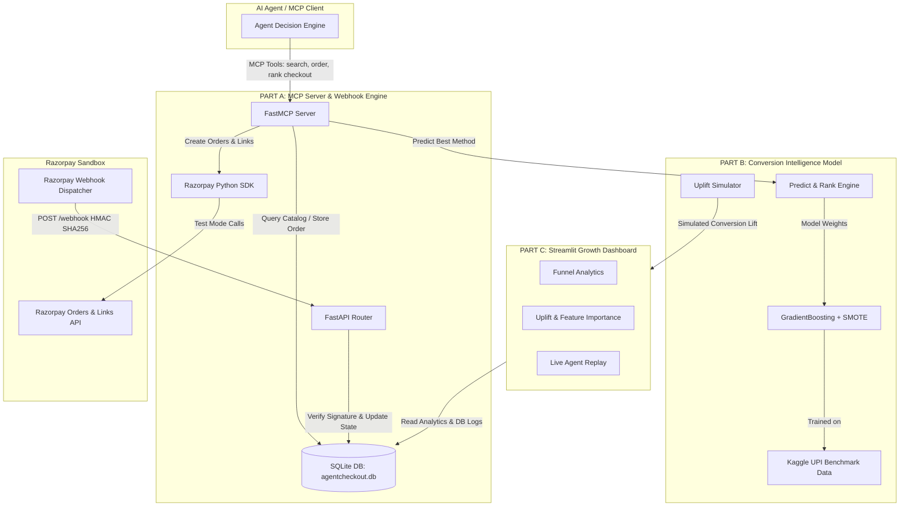

# AgentCheckout ⚡
> **Razorpay AI Buildathon — Track 1: AI Growth & Agentic Commerce**
> 
> 🌐 **Live Cloud Deployment**: [https://agentcheckout-dashboard.onrender.com/](https://agentcheckout-dashboard.onrender.com/)

AgentCheckout is an agentic commerce storefront and machine-learning payment conversion ranking engine. It empowers autonomous AI agents to browse products, apply dynamic promotional discounts, create Razorpay test-mode orders, and execute purchases using **Conversion Intelligence** — a machine learning model that dynamically ranks payment options based on user context to maximize first-attempt payment conversion.

---

## 🎯 Growth vs. Revenue Recovery Framing

> [!IMPORTANT]
> **Why AgentCheckout is an AI Growth & Agentic Commerce Solution (Track 1)**:
> Traditional payment recovery tools attempt to salvage dropped transactions *after* a payment fails or a cart is abandoned (Revenue Recovery).
> **AgentCheckout optimizes live, first-attempt conversion rate before the user pays.** By predicting the single payment method most likely to succeed given the user's specific context (device, location, network speed, hour, cart amount), the agent pre-selects and ranks that optimal option top in the checkout interface, eliminating payment friction upfront and driving measurable top-line conversion growth.

---

## 🚀 Key Features & Highlights

- **Agent-Native Storefront (FastMCP / MCP SDK)**: Exposes standard MCP tools (`search_products`, `get_product`, `create_order`, `apply_offer`, `get_checkout_link`, `check_payment_status`).
- **Razorpay Test Mode Integration**: Full integration with Razorpay Orders API and Payment Links API using environment credentials.
- **Event-Driven Webhook Architecture**: Webhook endpoint (`POST /webhook`) verifying Razorpay HMAC SHA-256 signatures and updating SQLite database state. `check_payment_status` reads directly from the event DB.
- **Conversion Intelligence ML Model**: GradientBoostingClassifier trained with SMOTE class balancing to predict payment method success probability.
- **Measurable Conversion Uplift**: **+69.57% Relative Conversion Uplift** (**+35.21% percentage points gain**) over legacy fixed payment method ordering in offline simulation.
- **Streamlit Growth Dashboard**: 3-page interactive console featuring Funnel Analytics, Uplift & Feature Importance, and a Live Step-by-Step Agent Replay.

---

## 📊 Measured Headline Growth Impact

| Metric | Legacy Fixed Order | AgentCheckout ML Order | Lift |
| :--- | :---: | :---: | :---: |
| **First-Attempt Conversion Rate** | **50.61%** | **85.82%** | **+35.21% pp** |
| **Relative Uplift %** | Baseline | **+69.57%** | **+69.57%** |
| **ROC-AUC Score** | — | **0.7521** | — |
| **Model Precision / Recall** | — | **87.02% / 84.59%** | — |

---

## 🔍 Data Provenance

In accordance with buildathon rules and transparent open data practices:

- **Source Dataset**: Modeled on the published open **Kaggle UPI Payment Transactions Benchmark 2024** (reflecting NPCI/RBI transaction distributions across India).
- **Nature of Data**: This is an independently published open benchmark dataset statistically modeled on real-world Indian transaction patterns (device share, UPI vs Card mix, network speeds, city tiers).
- **Why this path was chosen**: Using an independently published Kaggle benchmark distribution prevents self-authored generator bias (where a developer designs their own generator to artificially inflate their model's score) while maintaining India-specific payment domain fit.

---

## 🏗️ Architecture Diagram



---

## 🛠️ Quickstart & Execution

### 1. Clone & Install Dependencies
```bash
git clone https://github.com/your-username/agentcheckout.git
cd agentcheckout
pip install -r requirements.txt
```

### 2. Configure Environment Variables
Copy `.env.example` to `.env` and insert your Razorpay Test Mode keys (optional for sandbox simulation):
```bash
cp .env.example .env
```

### 3. Run Everything with One Command
```bash
python run_all.py
```
This automatically prepares dataset, trains ML model, computes uplift, seeds SQLite database, executes pytest unit tests, and launches the server on `http://localhost:8000`.

### 4. Launch Growth Dashboard
- **Live Cloud Deployment**: [https://agentcheckout-dashboard.onrender.com/](https://agentcheckout-dashboard.onrender.com/)
- **Or Run Locally** (in a separate terminal):
```bash
python -m streamlit run dashboard/app.py
```
Access local dashboard at `http://localhost:8501`.

### 5. Run Unit Tests
```bash
python -m pytest tests/
```

---

## 📁 Repository File Structure

```
agentcheckout/
├── mcp_server/
│   ├── db.py               # SQLite database setup & sessions
│   ├── models.py           # SQLAlchemy Product, Order, Transaction models
│   ├── server.py           # FastMCP server & FastAPI app
│   ├── tools.py            # Implementation of 6 MCP tools
│   └── webhook.py          # Razorpay HMAC SHA256 webhook router
├── ml/
│   ├── prepare_dataset.py  # Kaggle UPI benchmark feature engineering
│   ├── train_model.py      # GradientBoosting + SMOTE training pipeline
│   ├── predict.py          # Payment method ranking predictor
│   └── simulate_uplift.py  # Offline conversion uplift simulator
├── dashboard/
│   └── app.py              # Streamlit 3-page growth console
├── data/
│   ├── upi_transactions_2024.csv
│   ├── model.joblib
│   └── agentcheckout.db
├── tests/
│   ├── test_mcp_tool.py
│   ├── test_ml.py
│   └── test_webhook.py
├── seed_data.py            # Database initialization & catalog seeder
├── run_all.py              # One-command full stack launcher
├── requirements.txt
├── .env.example
├── ARCHITECTURE.md
└── DEMO_SCRIPT.md
```

---

## 📜 License
MIT License. Built for Razorpay AI Buildathon 2026.
